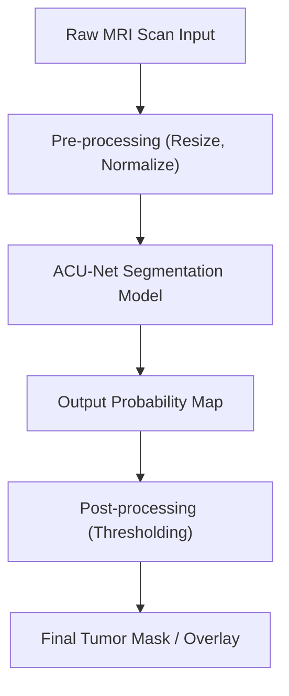
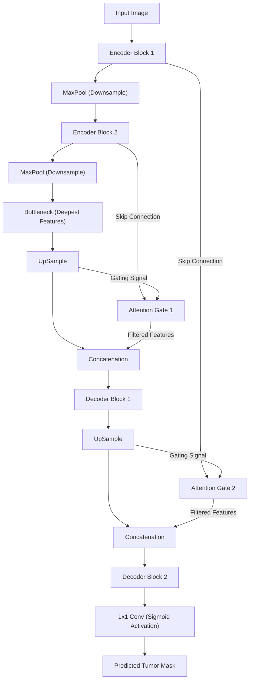
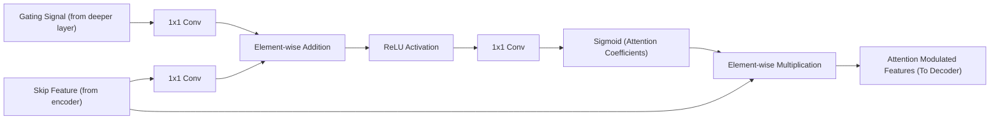
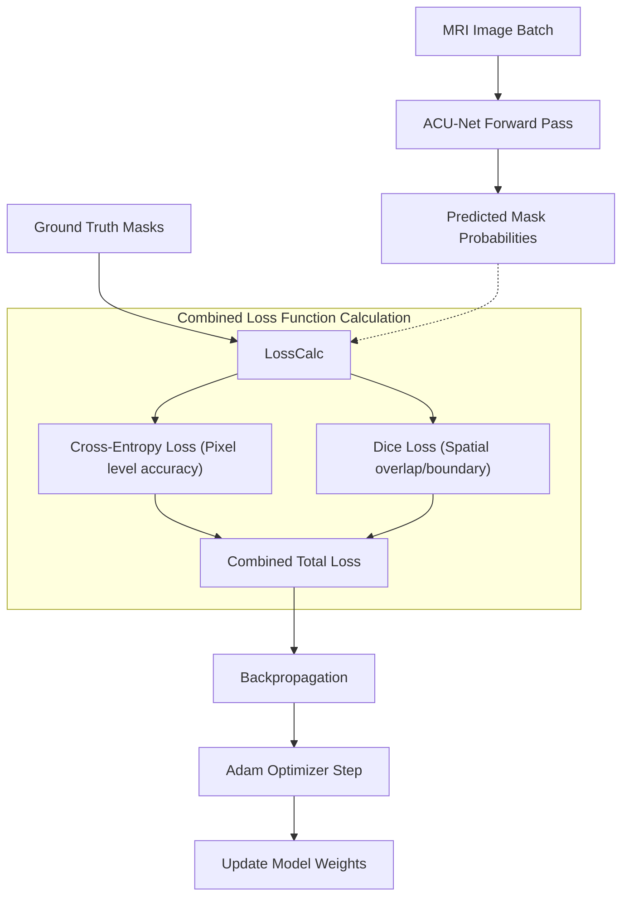

# ACU-Net Model Flowcharts

This document outlines the detailed working process of the Attention-based Convolutional U-Net (ACU-Net) implemented for brain tumor segmentation.

## 1. High-Level System Workflow
This flowchart illustrates the end-to-end process of the application, from receiving a raw MRI scan to outputting the final tumor overlay.

## 2. ACU-Net Architecture Overview
The macro architecture of the ACU-Net. It follows a 'U' shape consisting of a contracting path (encoder) to capture context, and a symmetric expanding path (decoder) that enables precise localization using Attention Gates.

## 3. Attention Gate Mechanism
The attention mechanism allows the model to focus on target structures of varying shapes and sizes. It filters out irrelevant background features from the encoder's skip connections using contextual information from the deeper decoder layers (the gating signal).

## 4. Feature Extraction & Reconstruction Blocks
A detailed look inside the building blocks of the encoder and decoder.

```mermaid
graph TD
    subgraph "Encoder Block"
        E_In["Input Features"] --> E_C1["3x3 Convolution"]
        E_C1 --> E_BN1["Batch Normalization"]
        E_BN1 --> E_R1["ReLU"]
        E_R1 --> E_C2["3x3 Convolution"]
        E_C2 --> E_BN2["Batch Normalization"]
        E_BN2 --> E_R2["ReLU"]
        E_R2 --> E_Out["To MaxPool / Attention"]
    end

    subgraph "Decoder Block"
        D_In["Concatenated Features"] --> D_C1["3x3 Convolution"]
        D_C1 --> D_BN1["Batch Normalization"]
        D_BN1 --> D_R1["ReLU"]
        D_R1 --> D_C2["3x3 Convolution"]
        D_C2 --> D_BN2["Batch Normalization"]
        D_BN2 --> D_R2["ReLU"]
        D_R2 --> D_Out["To Upsample / Final Output"]
    end
```

## 5. Training Pipeline & Loss Calculation
How the ACU-Net model is trained using a specialized combined loss function to handle severe class imbalance common in medical imaging (tumors make up a small portion of the brain scan).

